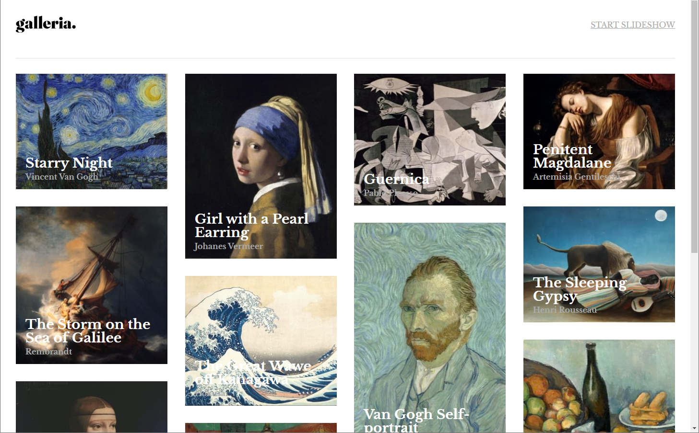

# FrontEnd Mentor Challange

This is a solution to the [Galleria slideshow site challenge on Frontend Mentor](https://www.frontendmentor.io/challenges/galleria-slideshow-site-tEA4pwsa6).

### Screenshot

### Built with

- Semantic HTML5 markup
- CSS3
- Flexbox
- CSS Grid
- [Styled-components](https://styled-components.com/) - NPM package for styling purpouses
- React router
- [Framer motion](https://www.framer.com/motion/) - NPM package for animation purpouses
- [React](https://reactjs.org/) - JS framework

### Links

- [Live Site URL](https://galleria-slideshow-blaumanis.netlify.app/)

### Things implemented

- Responsive design
- Slideshow
- Whole page animations
- Modal
- Global state (done with context API)
- Dynamic routing

